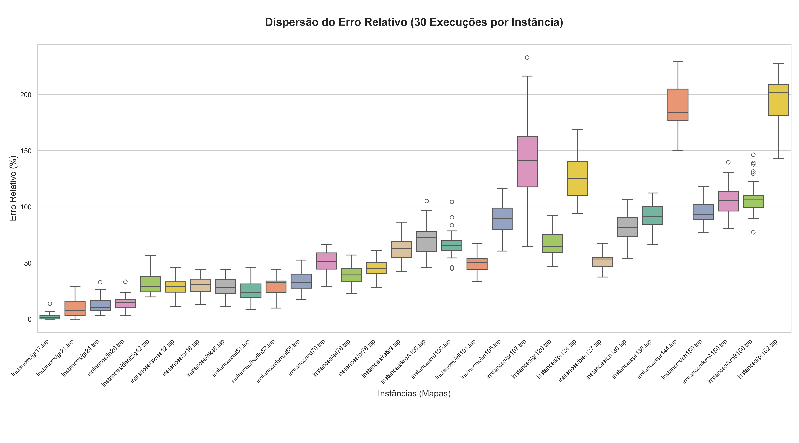
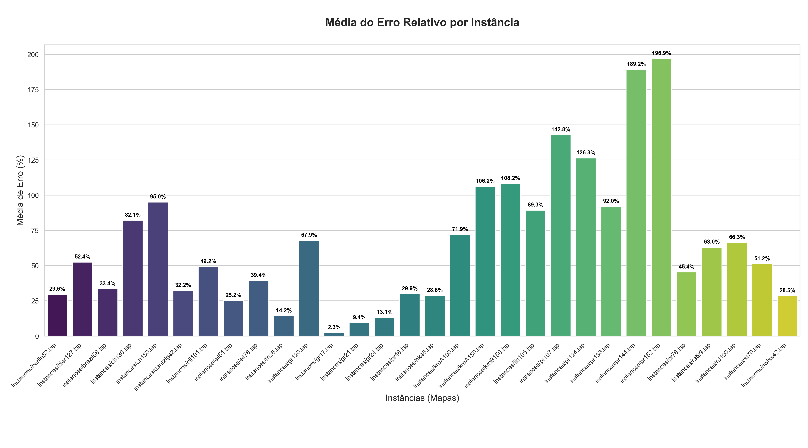

# Relatório: Algoritmo Genético aplicado ao Problema do Caixeiro Viajante (TSP)

## 1. Estrutura do Algoritmo Genético

Neste trabalho, construímos um Algoritmo Genético para resolver o Problema do Caixeiro Viajante (TSP). O nosso maior cuidado durante o desenvolvimento foi garantir que as rotas geradas fossem sempre caminhos válidos (visitando todas as cidades exatamente uma vez) e que o código rodasse em um tempo razoável. 

Para isso, tomamos algumas decisões de projeto:

### Tamanho da População (Abordagem Dinâmica)
Em vez de chutar um número fixo de indivíduos para todos os mapas, percebemos que mapas maiores precisavam de uma variedade genética maior para não "empacar" logo nas primeiras gerações. Por isso, criamos a função `definir_tamanho_populacao`, que ajusta a quantidade de rotas de acordo com a dificuldade da instância:
* Mapas menores (até 60 cidades): População de 100.
* Mapas médios (até 110 cidades): População de 120.
* Mapas maiores: População de 160.

### Operadores Escolhidos
* **Seleção (Torneio):** Utilizamos o Torneio com $k=3$ indivíduos. O aumento no número de participantes do torneio visou aumentar a pressão seletiva, forçando o algoritmo a escolher rotas mais otimizadas para reprodução, já que retiramos a busca local.
* **Cruzamento (Order Crossover / PMX):** Como o TSP exige uma permutação sem repetições, o cruzamento preserva um trecho do primeiro pai e preenche o restante com a ordem do segundo pai, evitando rotas inválidas.
* **Mutação (Swap):** Troca a posição de duas cidades aleatórias na rota.
* **Substituição (Elitismo):** A nova geração se junta à antiga, e a população é ordenada pelo *fitness* (menor distância). Os piores são descartados, garantindo que o melhor indivíduo global nunca seja perdido.

### Critério de Parada
Para evitar que o código ficasse rodando infinitamente à toa, colocamos duas travas de parada:
1. O limite máximo absoluto de 1000 gerações.
2. Um limite de **estagnação de 150 gerações**. 
Isso significa que, se o algoritmo ficar 150 gerações seguidas sem conseguir achar uma rota menor do que a atual, ele entende que já convergiu o máximo que dava e interrompe o laço, otimizando bastante o tempo de execução nos testes.

## 2. Ajuste e Escolha de Parâmetros

Para a definição final dos parâmetros, separamos inicialmente 5 instâncias de tamanhos variados (`gr17`, `dantzig42`, `berlin52`, `eil76` e `kroA100`). Percebemos que, por não utilizarmos uma técnica de busca local no modelo, o algoritmo precisava de uma **alta taxa de cruzamento** para explorar o espaço de busca e uma **taxa de mutação mais agressiva** do que o padrão da literatura para evitar estagnação precoce em mapas gigantes.

Após testes e análise da dispersão do erro, os parâmetros definitivos configurados no `master.py` para a rodada final foram:
* **Taxa de Cruzamento:** 95% (0.95) - Garante alta exploração e recombinação de genomas.
* **Taxa de Mutação:** 30% (0.30) - Elevada propositalmente para forçar "micro-saltos" no espaço de busca quando as rotas começam a convergir e estagnar.

## 3. Resultados Finais

Com os parâmetros otimizados definidos, o algoritmo foi executado **30 vezes para cada uma das 30 instâncias**, totalizando 900 execuções do Algoritmo Genético. O erro relativo percentual foi calculado comparando o *fitness* da melhor rota encontrada com o limite ótimo conhecido.

### → Gráfico de Dispersão (Box-plot)
O gráfico abaixo apresenta a dispersão do erro relativo percentual ao longo das 30 execuções para cada mapa, ilustrando a consistência do algoritmo (amplitude interquartil) diante da aleatoriedade natural do processo evolutivo.

### → Tabela de Resultados Consolidados

Abaixo estão os dados extraídos das execuções em lote, detalhando o comportamento absoluto e relativo da otimização:

| Instância | Min (Dist) | Média (Dist) | Máx (Dist) | Min (Erro %) | Média (Erro %) | Máx (Erro %) | Desvio Pad (Erro) |
|:---|---:|---:|---:|---:|---:|---:|---:|
| gr17 | 2085 | 2132.37 | 2370 | 0.0 | 2.27 | 13.67 | 2.95 |
| gr21 | 2707 | 2961.7 | 3499 | 0.0 | 9.41 | 29.26 | 8.11 |
| gr24 | 1310 | 1439.27 | 1691 | 2.99 | 13.15 | 32.94 | 7.33 |
| fri26 | 968 | 1070.23 | 1250 | 3.31 | 14.22 | 33.4 | 6.63 |
| swiss42 | 1412 | 1635.83 | 1863 | 10.92 | 28.5 | 46.35 | 8.43 |
| dantzig42 | 837 | 924.23 | 1094 | 19.74 | 32.22 | 56.51 | 10.57 |
| hk48 | 12727 | 14763.27 | 16557 | 11.05 | 28.81 | 44.46 | 8.05 |
| gr48 | 5716 | 6552.83 | 7271 | 13.28 | 29.86 | 44.09 | 7.63 |
| eil51 | 464 | 533.4 | 621 | 8.92 | 25.21 | 45.77 | 8.73 |
| berlin52 | 8291 | 9777.07 | 10890 | 9.93 | 29.63 | 44.39 | 7.6 |
| brazil58 | 29928 | 33870.73 | 38770 | 17.85 | 33.38 | 52.67 | 9.46 |
| st70 | 872 | 1020.57 | 1122 | 29.19 | 51.2 | 66.22 | 10.34 |
| pr76 | 138644 | 157218.63 | 174602 | 28.19 | 45.36 | 61.43 | 8.37 |
| eil76 | 659 | 749.8 | 845 | 22.49 | 39.37 | 57.06 | 9.2 |
| rat99 | 1728 | 1973.9 | 2258 | 42.69 | 63.0 | 86.46 | 11.75 |
| kroA100 | 31081 | 36594.07 | 43664 | 46.04 | 71.95 | 105.17 | 13.69 |
| rd100 | 11466 | 13153.87 | 16173 | 44.96 | 66.29 | 104.46 | 11.86 |
| eil101 | 842 | 938.2 | 1054 | 33.86 | 49.16 | 67.57 | 7.66 |
| lin105 | 23100 | 27218.37 | 31130 | 60.65 | 89.29 | 116.5 | 13.68 |
| pr107 | 72996 | 107558.0 | 147560 | 64.77 | 142.78 | 233.07 | 37.95 |
| gr120 | 10209 | 11656.93 | 13345 | 47.06 | 67.92 | 92.24 | 11.59 |
| pr124 | 114427 | 133612.13 | 158735 | 93.85 | 126.35 | 168.91 | 21.62 |
| bier127 | 162689 | 180253.97 | 197810 | 37.54 | 52.39 | 67.24 | 6.94 |
| ch130 | 9416 | 11128.9 | 12616 | 54.11 | 82.14 | 106.48 | 11.57 |
| pr136 | 161336 | 185781.87 | 205430 | 66.72 | 91.98 | 112.28 | 12.13 |
| pr144 | 146486 | 169300.37 | 192603 | 150.25 | 189.22 | 229.03 | 19.0 |
| ch150 | 11555 | 12730.27 | 14239 | 77.01 | 95.01 | 118.12 | 10.68 |
| kroA150 | 47992 | 54697.23 | 63583 | 80.94 | 106.22 | 139.72 | 13.96 |
| kroB150 | 46338 | 54400.93 | 64426 | 77.34 | 108.19 | 146.56 | 15.79 |
| pr152 | 179221 | 218793.5 | 241431 | 143.24 | 196.94 | 227.67 | 19.81 |

[Clique aqui para acessar a Tabela de Resultados (CSV)](graficos/03_tabela_resultados_20260404_234323.csv)

### → Média do Erro Relativo (Gráfico de Barras)
O gráfico a seguir destaca a média do erro relativo percentual consolidada por instância.

## 4. Análise e Conclusões do Experimento

A partir da extração dos dados gerados nas 900 execuções, foi possível traçar o exato comportamento matemático do Algoritmo Genético Puro aplicado ao Caixeiro Viajante:

1. **Sucesso Absoluto em Baixa Complexidade:** Em espaços de busca menores (como `gr17` e `gr21`), o algoritmo encontrou a **rota ótima exata (0% de erro)** em várias das 30 execuções. No mapa `gr17`, a média geral de erro foi de apenas 2.27%, comprovando a eficácia matemática dos operadores de cruzamento e mutação implementados.
2. **Correlação de Escalabilidade:** Foi identificada uma forte correlação estatística positiva (~83.4%) entre a dimensão do problema (quantidade de cidades) e o erro médio. 
3. **A Limitação do Genético Puro:** O aumento expressivo do erro nas maiores instâncias (como `pr144` e `pr152`) evidencia o principal comportamento esperado na literatura: em mapas massivos, apenas *swaps* aleatórios não são suficientes para desemaranhar rotas complexas antes da estagnação. O experimento cumpre seu papel ao provar na prática que, para instâncias acima de 100 cidades, a introdução de Algoritmos Meméticos (hibridização com buscas locais, como a heurística 2-opt) torna-se indispensável.

## 👤 Discentes

Este trabalho acadêmico foi produzido pelos discentes: [**Beatriz Souto**](https://github.com/beatrizsouto3) e [**Vinicius de Oliveira**](https://github.com/viniciusdomg).